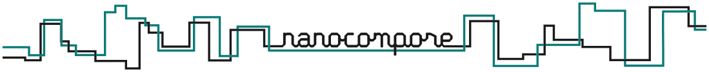
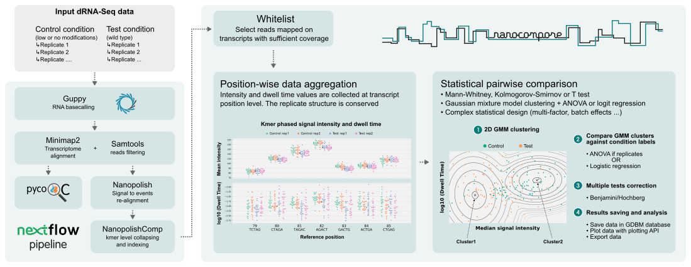

---

---

**Nanocompore identifies differences in ONT nanopore sequencing raw signal corresponding to RNA modifications by comparing 2 samples**

Nanocompore compares 2 ONT nanopore direct RNA sequencing datasets from different experimental conditions expected to have a significant impact on RNA modifications. It is recommended to have at least 2 replicates per condition. For example one can use a control condition with a significantly reduced number of modifications such as a cell line for which a modification writing enzyme was knocked-down or knocked-out. Alternatively, on a smaller scale transcripts of interests could be synthesized in-vitro.

**Full documentation is available at http://nanocompore.rna.rocks**

## Companion repositories

* [NanoCompore_pipeline](https://github.com/tleonardi/nanocompore_pipeline): Nextflow pipeline to preprocess data for NanoCompore
* [Nanocompore_analysis](https://github.com/tleonardi/nanocompore_paper_analyses): Analyses performed with Nanocompore for the BioRxiv preprint
* [NanopolishComp](https://github.com/tleonardi/NanopolishComp): Collapse Nanopolish eventalign output per kmer, required before running NanoCompore

## Main authors

* Tommaso Leonardi - tom {at} tleo.io
* Adrien Leger - aleg {at} ebi.ac.uk
