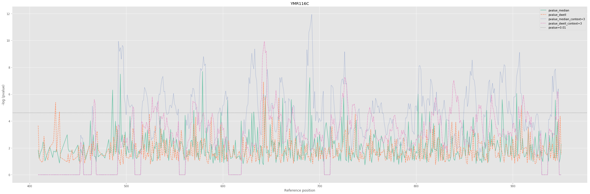
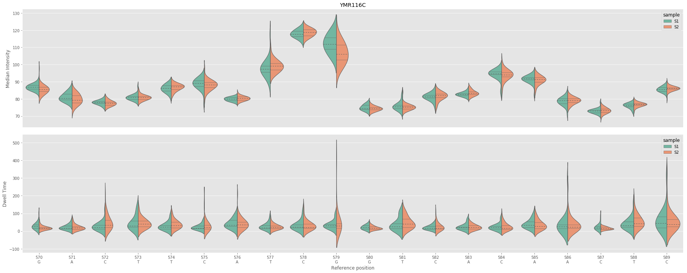

[](https://lbesson.mit-license.org/)
[](https://www.python.org/)

---

**Nanocompore identifies differences in ONT nanopore sequencing raw signal corresponding to RNA modifications by comparing 2 samples**

Nanocompore compares 2 ONT nanopore direct RNA sequencing datasets from different experimental conditions expected to have a significant impact on RNA modifications. It is recommended to have at least 2 replicates per condition. For example one can use a control condition with a significantly reduced number of modifications such as a cell line for which a modification writing enzyme was knocked-down or knocked-out. Alternatively, on a smaller scale transcripts of interests could be synthesized in-vitro.

---

# Installation

Ideally, before installation, create a clean **python3.5+** virtual environment to deploy the package. **Python 2 is not supported**. For example you can use conda or virtualenvwrapper.

With [virtualenvwrapper](https://virtualenvwrapper.readthedocs.io/en/latest/install.html):
```
mkvirtualenv nanocompore -p python3.6
```

With [conda](https://conda.io/projects/conda/en/latest/user-guide/install/index.html):
```
conda create -n nanocompore python=3.6
```
## Dependencies

Nanocompore relies on a the following robustly maintained third party python libraries:
* numpy >= 1.14.0
* scipy >= 1.1.0
* tqdm >= 4.23.4
* pyfaidx >= 0.5.4.1
* matplotlib >= 2.2.2
* seaborn >= 0.9.0
* pandas >= 0.23.3
* statsmodels >= 0.9.0
* scikit-learn >= 0.20
* bedparse >= 0.1.2

The correct versions of packages are installed together with the software when using pip.

## Option 1: Direct installation with pip from github (recommended)

* To install the package with an ssh key
```
pip3 install git+ssh://git@github.com/tleonardi/nanocompore.git
```

* To install the package with https/ssh
```
pip3 install git+https://github.com/tleonardi/nanocompore.git
```

## Option 2: Clone the repository and install locally in develop mode

With this option, the package will be locally installed in “editable” or “develop” mode. This allows the package to be both installed and editable in project form. This is the recommended option if you wish to modify the code and/or participate to the development of the package (see [contribution guidelines](https://github.com/tleonardi/nanocompore/blob/master/CONTRIBUTING.md)).

`git clone https://github.com/tleonardi/nanocompore.git` or bleeding edge `git clone --branch devel https://github.com/tleonardi/nanocompore.git`

`cd nanocompore`

[`chmod u+x setup.py`]

`pip3 install -e ./`

# Data preparation

Before using nanocompore, sequencing data have to be basecalled (Albacore or Guppy), aligned on a transcriptome reference and resquiggled with Nanopolish. To simplify the data preprocessing we wrote a Nextflow pipeline that automatise all these steps as well as extra quality control steps: https://github.com/tleonardi/nanocompore_pipeline

### Basecalling with Guppy (https://community.nanoporetech.com/downloads)

```

```

### Alignment with [Minimap2](https://github.com/lh3/minimap2) v...

```

```

### Read indexing and resquiggling with [Nanopolish](https://github.com/jts/nanopolish) v...

```

```

### Kmer level event align data collapsing with [NanopolishComp Eventalign_collapse](https://github.com/a-slide/NanopolishComp)

```

```

# Nanocompore usage


The preparation of data and the package usage are detailed in the [usage jupyter notebook](https://github.com/a-slide/nanocompore/blob/master/tests/nanocompore_usage.ipynb)

Example of pvalue analysis using Mann_Whitney paired test:



Example of signal shift between 2 samples:



## Alternative and complementary packages

Here is a non-exhaustive list of alternative/complementary packages that could also be used to analyse RNA methylation from nanopore sequencing datasets:

* [Tombo](https://github.com/nanoporetech/tombo)
* ...

## Reporting bugs, feature request and contributing to development

Thanks for considering contributing to our_package!

Please see [contribution guidelines](https://github.com/tleonardi/nanocompore/blob/master/CONTRIBUTING.md) as well as the [code of conduct](https://github.com/tleonardi/nanocompore/blob/master/CODE_OF_CONDUCT.md) for more information.


## Authors

* Adrien Leger - aleg {at} ebi.ac.uk
* Tommaso Leonardi - tom {at} tleo.io

## Acknowledgements
