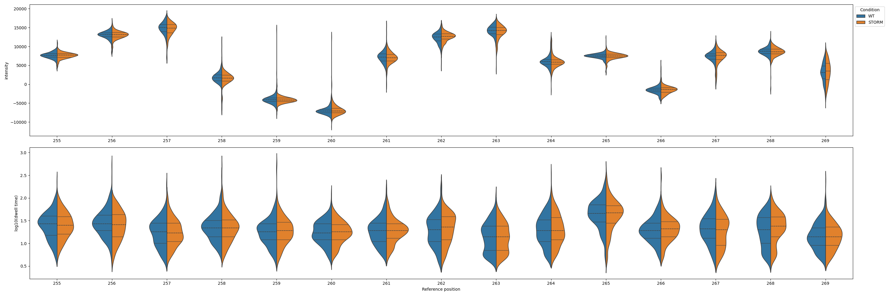

# Plotting

Nanocompore's command line interface provides subcommands to easily generate plots. This page provides examples how to use this plotting interface. Alternatively, you can use the [plotting module](/plotting_api.md) programatically in Python.

All plotting commands are executed with `nanocompore plot <plot_type>`. You can use the `--help` flag to get a description of all possible parameters that can be provided for the specific type of plot.

### pvalues
Command: `nanocompore plot pvalues`

Plots p-values from a finished Nanocompore run over a region.

```bash
positional arguments:
  reference             Reference name, matching a name from the FASTA reference used in the config.

options:
  -h, --help            show this help message and exit
  --config CONFIG, -c CONFIG
                        Path to the input configuration YAML file.
  --output OUTPUT, -o OUTPUT
                        Path and filename where the plot will be saved.
  --start START         0-based index on the reference.
  --end END             0-based index on the reference.
  --threshold THRESHOLD
                        Threshold p-value that will be drawn as a line.
  --kind {lineplot,barplot}
                        Kind of plot to draw. Default: lineplot
  --figsize FIGSIZE     Figure size. Default: 30,10
  --tests TESTS         Which tests to plot. By default all executed tests are shown.
  --palette PALETTE     Color palette to use. Default: Dark2
```

Palettes can be picked from the standard matplotlib colormaps: [https://matplotlib.org/stable/users/explain/colors/colormaps.html](https://matplotlib.org/stable/users/explain/colors/colormaps.html)

Example plot:


### signal

Command: `nanocompore plot signal`

Plots the signal measurements from the input data files listed in the configuration.
Note: this will show all input data without performing the filtering and downsampling that are during the execution of the Nanocompore run command.

```bash
positional arguments:
  reference             Reference name, matching a name from the FASTA reference used in the config.

options:
  -h, --help            show this help message and exit
  --config CONFIG, -c CONFIG
                        Path to the input configuration YAML file.
  --output OUTPUT, -o OUTPUT
                        Path and filename where the plot will be saved.
  --start START         0-based index on the reference.
  --end END             0-based index on the reference.
  --kind {violinplot,swarmplot,boxenplot}
                        Kind of plot to draw. Default: violinplot
  --figsize FIGSIZE     Figure size: WIDTH,HEIGHT. Default: 30,10
  --split_samples       Split results by sample instead of by condition.
  --markersize MARKERSIZE
                        Size of the points if swarmplot is used.
  --palette PALETTE     Color palette to use. Default: Dark2
```

Palettes can be picked from the standard matplotlib colormaps: [https://matplotlib.org/stable/users/explain/colors/colormaps.html](https://matplotlib.org/stable/users/explain/colors/colormaps.html)

Example plot:



One can also change the kind of plot and split by sample instead of condition:


### [position](Position)

Command: `nanocompore plot position`

Plot the signal data for a specific position as a 2D plot. Note: this will plot the data as it is in the input files, without applying the filtering performed by Nanocompore.

```bash
positional arguments:
  reference             Reference name, matching a name from the FASTA reference used in the config.
  position              Position to plot (0-based index).

options:
  -h, --help            show this help message and exit
  --config CONFIG, -c CONFIG
                        Path to the input configuration YAML file.
  --output OUTPUT, -o OUTPUT
                        Path and filename where the plot will be saved.
  --figsize FIGSIZE     Figure size: WIDTH,HEIGHT. Default: 10,10
  --point_size POINT_SIZE
                        Size of the data points
  --xlim XLIM           Set specific range for the x-axis: MIN,MAX. By default it will be inferred from the data
  --ylim YLIM           Set specific range for the x-axis: MIN,MAX. By default it will be inferred from the data
  --kde                 Plot the KDE of the intensity/dwell bivarariate distributions in the two samples.
  --kde_levels KDE_LEVELS
                        How many levels of the gaussian distributions to show
  --palette PALETTE     Use a single palette to select both point and gmm colors.
```

Palettes can be picked from the standard matplotlib colormaps: [https://matplotlib.org/stable/users/explain/colors/colormaps.html](https://matplotlib.org/stable/users/explain/colors/colormaps.html)

Example plot:


### gmm

Command: `nanocompore plot gmm`

Plot the GMM fitting for a position. This replicates all data filtering and produces identical GMM fitting to the one obtained by the `run` command. The resulting parameters for the two Gaussian distributions are used to sample points and plot their KDEs. Note that this is different from the `position` plot where we show the KDEs of the input data, not the fitted Gaussians.

```bash

positional arguments:
  reference             Reference name, matching a name from the FASTA reference used in the config.
  position              Position to plot (0-based index).

options:
  -h, --help            show this help message and exit
  --config CONFIG, -c CONFIG
                        Path to the input configuration YAML file.
  --output OUTPUT, -o OUTPUT
                        Path and filename where the plot will be saved.
  --figsize FIGSIZE     Figure size: WIDTH,HEIGHT. Default: 10,10
  --point_size POINT_SIZE
                        Size of the data points
  --xlim XLIM           Set specific range for the x-axis: MIN,MAX. By default it will be inferred from the data
  --ylim YLIM           Set specific range for the x-axis: MIN,MAX. By default it will be inferred from the data
  --gmm_levels GMM_LEVELS
                        How many levels of the gaussian distributions to show
  --palette PALETTE     Use a single palette to select both point and gmm colors.
  --point_palette POINT_PALETTE
                        Which palette to use for plotting the points.
  --gmm_palette GMM_PALETTE
                        Which palette to use for plotting the gaussian distributions.
```

Palettes can be picked from the standard matplotlib colormaps: [https://matplotlib.org/stable/users/explain/colors/colormaps.html](https://matplotlib.org/stable/users/explain/colors/colormaps.html)

Example plot:


### coverage

Command: `nanocompore plot gmm`

Plot the read coverage for a region.

```bash
positional arguments:
  reference             Reference name, matching a name from the FASTA reference used in the config.

options:
  -h, --help            show this help message and exit
  --config CONFIG, -c CONFIG
                        Path to the input configuration YAML file.
  --output OUTPUT, -o OUTPUT
                        Path and filename where the plot will be saved.
  --start START         0-based index on the reference.
  --end END             0-based index on the reference.
  --figsize FIGSIZE     Figure size: WIDTH,HEIGHT. Default: 30,10
  --split_samples       Split results by sample instead of by condition.
  --palette PALETTE     Use a single palette to select both point and gmm colors.
```

Palettes can be picked from the standard matplotlib colormaps: [https://matplotlib.org/stable/users/explain/colors/colormaps.html](https://matplotlib.org/stable/users/explain/colors/colormaps.html)

Example plot:


